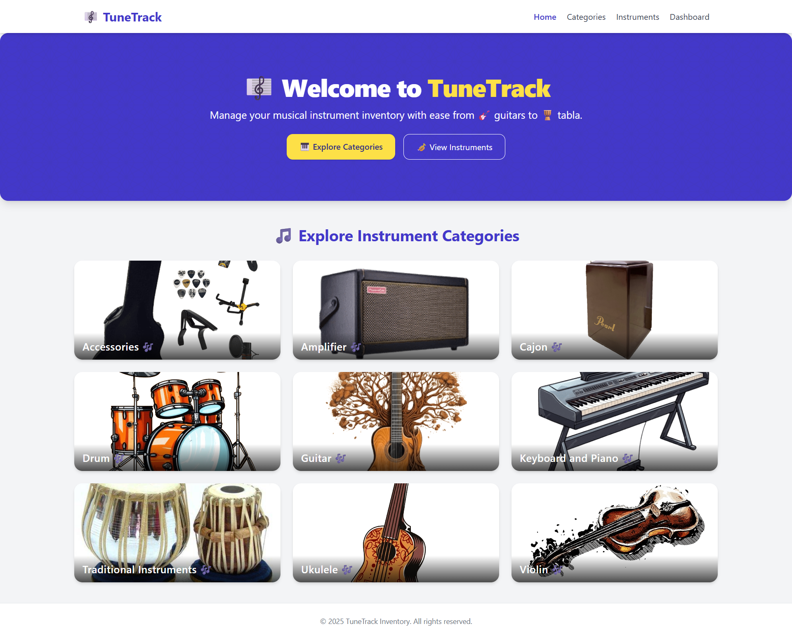
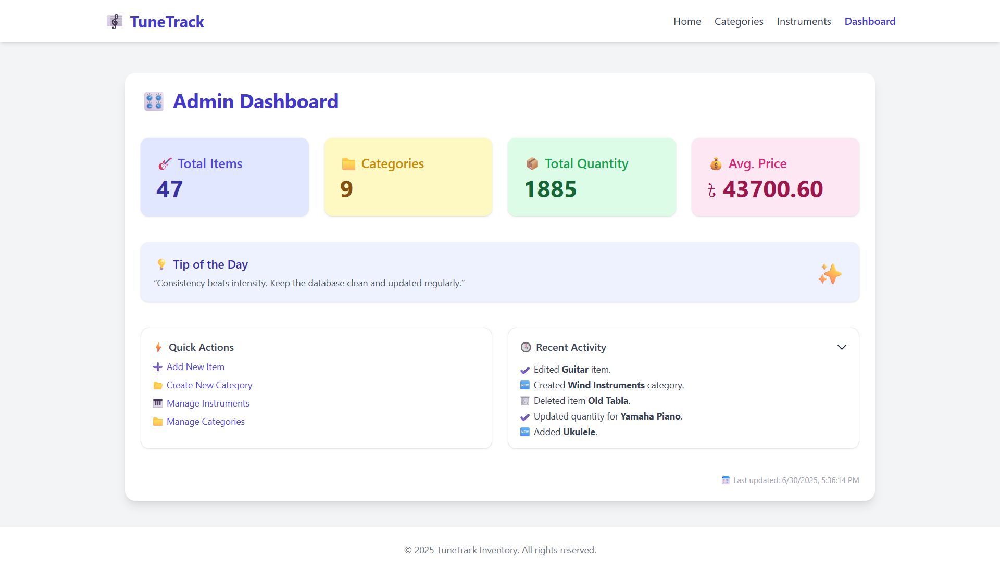

# 🎼 TuneTrack

**TuneTrack** is a simple, full-stack musical instrument inventory management application built with **Express.js**, **PostgreSQL**, and **Cloudinary**. It allows you to manage musical instrument categories and items with images, descriptions, prices, and more — perfect for admins of music stores or institutions.

---

## 🌐 [Click for Live Demo](https://tune-track.onrender.com/)

---

## 🚀 Features

- 🔍 View all instruments and categories
- ➕ Add, edit, and delete categories and instruments
- 📁 Upload images to Cloudinary
- 📊 Admin dashboard with live stats
- 🔐 Password confirmation for sensitive actions (like delete)
- 🧠 Responsive, clean UI with Tailwind CSS
- 🛠️ Organized using MVC structure

---

## 🛠️ Tech Stack

- **Backend**: Node.js, Express.js
- **Database**: PostgreSQL
- **Templating**: EJS
- **Styling**: Tailwind CSS
- **File Uploads**: Multer + Cloudinary
- **Validation**: express-validator
- **Deployment**: Railway

---

## 🧪 Future Enhancements (Ideas)

* ✅ Expanded Recent Activity panel
* ✅ More admin friendly features
* 🔍 Search bar in dashboard
* 📥 Export inventory as CSV
* 👥 User auth & roles

## 📸 Screenshots

## 🧑‍💻 Author

**Mainul Islam Nirob**

* 🔗 [GitHub](https://github.com/Mainul-Islam-Nirob)
